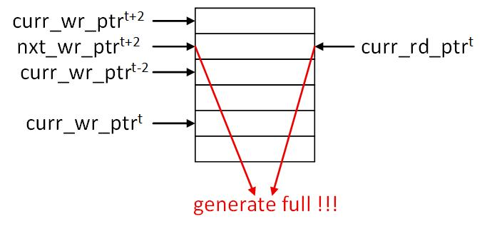
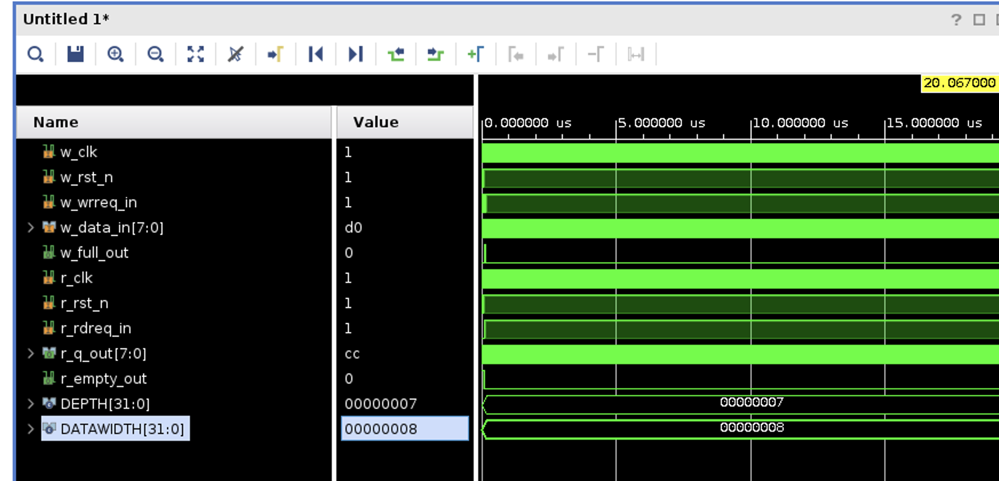
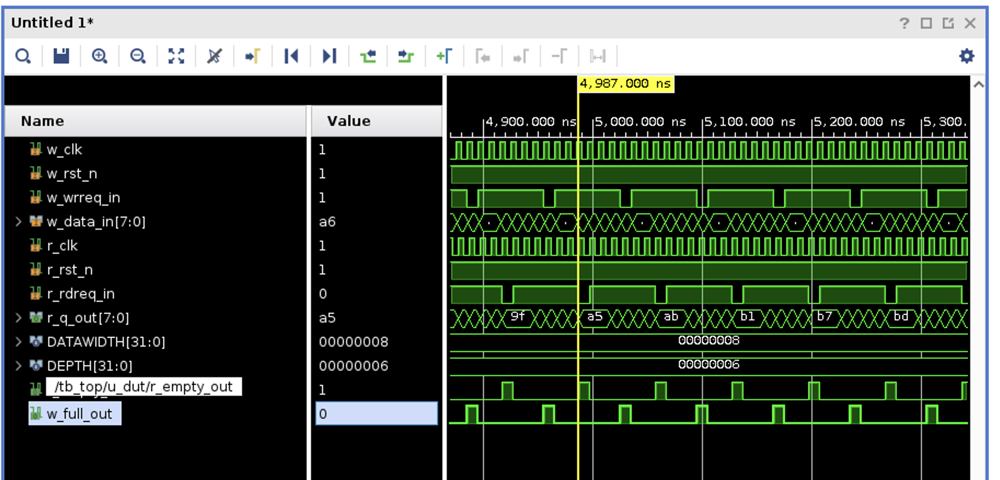

# How Synchronization Stages Affect FIFO Throughput

## Setup

A standard async FIFO synchronizes Gray-coded pointers across clock domains
with a 2-flop synchronizer in each direction:

```
WRITE DOMAIN                                READ DOMAIN

wr_bin --> wr_gray --+                          +--> rd_gray --> rd_bin
                     |                          |
                     +----- 2FF sync ---------->|
                     |                          |
                     |<---------- 2FF sync -----+
                     v                          v
                   full                       empty
```

Question: given `S` synchronizer stages in each direction, what is the
**minimum FIFO depth** such that `full` / `empty` are never *unnecessarily*
asserted under sustained, matched-rate traffic?

> Note: this is a **latency** analysis, not a metastability analysis. Gray
> coding is required for CDC correctness under multi-bit transitions, but
> it does not reduce the staleness discussed below. The DEPTH conclusion
> is identical whether Gray or raw binary pointers are synchronized.

## Assumptions

- `w_clk` and `r_clk` have approximately the same frequency. If the writer
  is intrinsically faster than the reader, no depth prevents `full`;
  rate-matching is a separate constraint.
- Each pointer is registered at its source before crossing.
- `full` and `empty` outputs are registered.
- `S = 2` synchronizer flops per direction (baseline).

## Latency accounting

The writer's view of `rd_ptr` is delayed by:

| stage                                             | cycles |
| ------------------------------------------------- | ------ |
| `rd_ptr` registered at source                     | 1      |
| 2-FF synchronizer into write domain               | S = 2  |
| `full` output registered before stalling writer   | 1      |
| **total staleness the writer reacts to**          | **S + 2 = 4** |

By the time the writer can act on a given `rd_ptr` value, that value is
4 writer cycles old, and the writer may have committed up to 4 more writes
in the meantime. To guarantee no false `full`:

$$\text{DEPTH} - \text{occupancy} \;\ge\; S + 2$$

Symmetrically for the reader observing `wr_ptr` (the `empty` output is not
fed back into a pointer, so the round trip has one fewer register):

$$\text{occupancy} \;\ge\; S + 1$$

Adding the two bounds:

$$\text{DEPTH}_{\min} = (S+2) + (S+1) = 2S + 3$$

For `S = 2`, **DEPTH ≥ 7**.

| S | DEPTH_min |
| - | --------- |
| 1 | 5         |
| 2 | 7         |
| 3 | 9         |

## Simulation results

Same-frequency clocks with a 2 ns phase shift, `wrreq` and `rdreq` asserted
every cycle, 2000 cycles:

| DEPTH | `w_full_cycles` | `r_empty_cycles` | notes                               |
| ----- | --------------- | ---------------- | ----------------------------------- |
| 6     | 287             | 288              | self-sustained full/empty ping-pong |
| 7     | 2               | 3                | startup transient only              |

At DEPTH = 6 the usable occupancy window `[S+1, DEPTH-(S+2)] = [3, 2]` is
empty, so the pointer difference cannot settle inside it: every stall on
one side propagates through the synchronizer and forces a stall on the
other side one round-trip later. At DEPTH = 7 the window `[3, 3]` is a
single valid point that steady-state traffic locks into.



## Reproduce

Change `DEPTH` in [verif/tb_top.sv](verif/tb_top.sv#L22), then run `make`.
To verify the scaling law, add a third flop to
[common/asynchronizer.v](common/asynchronizer.v) (`S = 3`) and confirm
DEPTH = 8 still ping-pongs while DEPTH = 9 does not.

When S=2, the minimum depth according to the scaling law is 7, which matches the simulation results shown below.



When S=2, DEPTH=6 still ping-pongs, as predicted by the scaling law.



